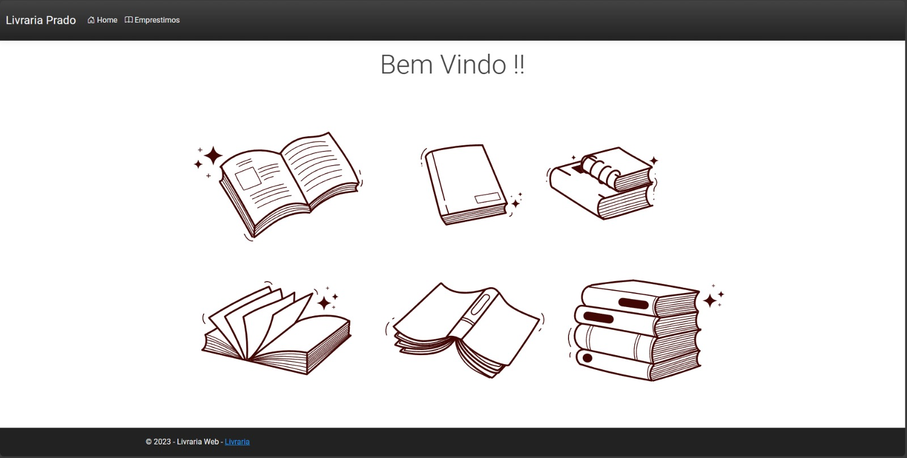
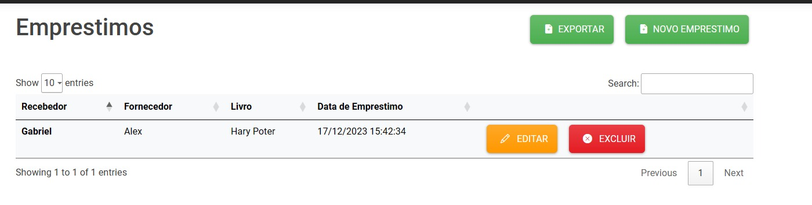

# Livraria Web

<a href="#sobre-o-projeto">Português </a>
  
  <a href="#overview">English </a>

  <hr>

# Overview

this Project is a ASP.NET MVC application that was built using ASP.Net Identity Concepts and SQlite
it has with objective simulate a Library Application as Manage the Rental books 

## Features

- Addition,Edition and deletion of book loans
- **Recording the current status of the loan im a Exel Table**

  # Screenshot

  ### Home Page


### Loan Table


# Testing

To Test Project, Follow the steps below

1. Dowload The Migrations
 ```dotnet ef database update ```

2. Open some Text Editor and write the comand:
 ```dotnet run ```

  


# Sobre o Projeto

Este projeto foi desenvolvido utilizando ASP.Net Core MVC e SQLite, proporcionando um Sistema de Empréstimo de Livros Online eficiente.

## Funcionalidades

- Adição, edição e exclusão de empréstimos.
- **Registro do status atual dos empréstimos em uma tabela no Excel.**

## Capturas de Tela

### Página Inicial


### Tabela de Empréstimos


# Testando

Para testar o projeto, siga os passos abaixo:


1. Baixe as Migrações
 ```dotnet ef database update ```

2. Abra Algum Editor De Texto e Digite o Comando:
 ```dotnet run ```


